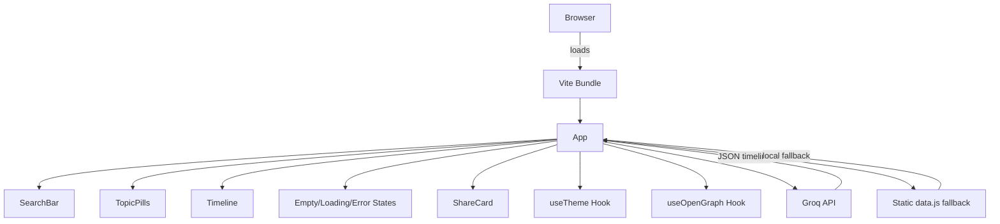
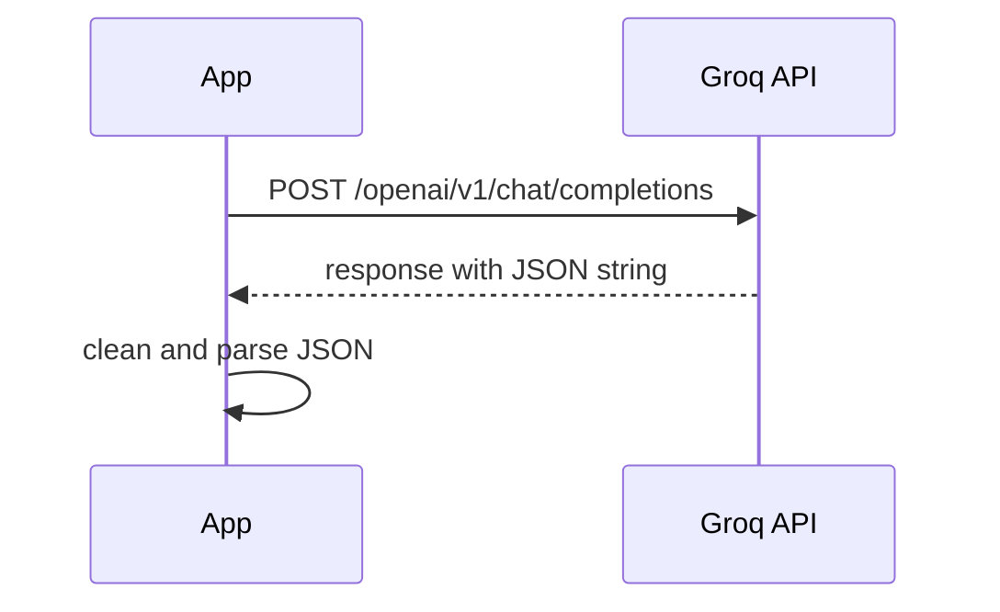
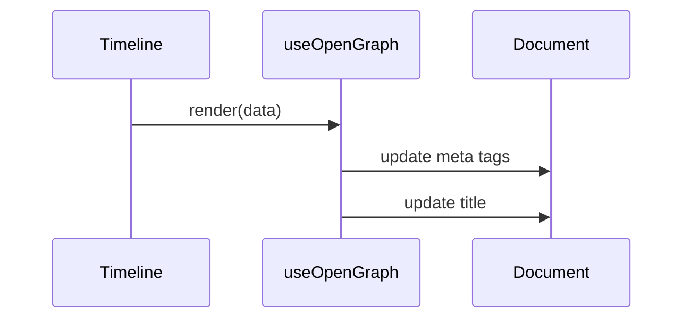

# Epochly.ai Architecture Documentation

## Overview

Epochly.ai is a lightweight React + Vite single-page application that generates and displays historical timelines for arbitrary topics. It combines:

- A modern React component architecture
- AI-powered timeline generation through a Groq OpenAI-compatible chat completion API
- Static topic fallback content via `src/data.js`
- A theme system with dark/light mode and localStorage persistence
- Animated timeline UI with nested mini-timelines for event context
- Open Graph metadata updates for social sharing
- Image export via `html2canvas`

This document explains the system design, component architecture, data flow, styling approach, and deployment model.

---

## Table of Contents

1. [Technology Stack](#technology-stack)
2. [High-Level System Design](#high-level-system-design)
3. [Low Level System Design](#low-level-system-design)
4. [Layered Architecture Diagram](#layered-architecture-diagram)
5. [Application Entry and Routing](#application-entry-and-routing)
6. [Core UI Structure](#core-ui-structure)
7. [Data Flow and API Integration](#data-flow-and-api-integration)
8. [Theme System](#theme-system)
9. [Styling and CSS Architecture](#styling-and-css-architecture)
10. [Hooks and Side Effects](#hooks-and-side-effects)
11. [Deployment and Build](#deployment-and-build)
12. [Extensibility and Future Enhancements](#extensibility-and-future-enhancements)

---

## Technology Stack

- React 18
- Vite
- React Router DOM
- HTML / CSS Modules
- Browser native `fetch`
- `html2canvas` for image export
- Groq OpenAI-compatible API for dynamic timeline generation

---

## High-Level System Design

> Note: Install the `bierner.markdown-mermaid` extension for VS Code markdown preview so these Mermaid diagrams display correctly.



### Architecture Summary

- The browser loads the Vite-generated bundle and mounts React in `src/main.jsx`.
- `App.jsx` manages application state and renders the search experience.
- Searches either resolve from local static data in `src/data.js` or call the AI API.
- Timeline content is rendered through nested components and uses CSS modules for scoped styles.
- Theme preference is persisted to `localStorage` and applied via a root-level CSS class.

---

## Application Entry and Routing

### `src/main.jsx`

This file bootstraps React and the router:

```js
import React from 'react'
import ReactDOM from 'react-dom/client'
import { BrowserRouter } from 'react-router-dom'
import App from './App.jsx'
import './index.css'

ReactDOM.createRoot(document.getElementById('root')).render(
  <React.StrictMode>
    <BrowserRouter>
      <App />
    </BrowserRouter>
  </React.StrictMode>
)
```

### Routing

Although this application currently renders a single page, `BrowserRouter` enables future route-based enhancements such as:

- `/timeline/:topic`
- `/share/:topic`
- `/history`

The `Timeline` component already uses `useNavigate` for related-topic navigation.

---

## Low Level System Design

```mermaid
flowchart LR
  SearchBar[SearchBar] -->|submit| App[App]
  TopicPills[TopicPills] -->|select topic| App
  App -->|resolve topic| FindTimeline[findTimeline()]
  FindTimeline -->|matches| Timeline[Timeline]
  App -->|calls API| GroqAPI[Groq API]
  GroqAPI -->|response| App
  App -->|render data| Timeline
  Timeline --> EventRow[EventRow]
  EventRow --> MiniTimeline[MiniTimeline]
  App --> ShareCard[ShareCard]
  ShareCard -->|exports| Download[PNG export]
```

## `src/App.jsx`

`App.jsx` is the main orchestration layer. It:

- Tracks UI state: `idle`, `loading`, `success`, `error`
- Stores selected topic, timeline content, and error messages
- Coordinates static fallback and AI-driven timeline generation
- Renders the theme toggle and search hero
- Passes timeline data to the `Timeline` component

### Search Experience

The app offers two search paths:

1. **Preset topic navigation** via `TopicPills`
2. **Custom search input** via `SearchBar`

When a search is submitted, it either:

- loads a static timeline from `src/data.js`, or
- fetches a generated timeline from the Groq API

---

## Data Flow and API Integration

### Static Data Fallback

`src/data.js` exports `TOPICS` and `PRESET_TOPICS`.

- `PRESET_TOPICS` provides quick topic buttons.
- `TOPICS` contains pre-defined timelines for selected subjects.
- The app checks `findTimeline(topic)` first before calling the API.

### AI Timeline API

`fetchTimeline(topic)` in `src/App.jsx` performs the API call.

#### Request flow



#### Response contract

The app expects returned timeline JSON with this structure:

- `topic`
- `intro`
- `events[]`
  - `date`
  - `title`
  - `summary`
  - `detail`
  - `type`
  - `subEvents[]`
    - `date`
    - `title`
    - `desc`
- `outro`
  - `summary`
  - `question`
- `related[]`
- `ongoing`

This contract is enforced via the prompt in `App.jsx`.

### Error handling

- API failures produce a user-facing message in `ErrorState`
- Invalid JSON parsing is surfaced as an error state
- `App.jsx` catches and stores errors in component state

---

## Theme System

### `src/hooks/useTheme.js`

The app includes a reusable theme hook.

```js
import { useState, useEffect } from 'react'

export function useTheme() {
  const [theme, setTheme] = useState(() => {
    const saved = localStorage.getItem('epochly-theme')
    if (saved) return saved
    return window.matchMedia('(prefers-color-scheme: light)').matches ? 'light' : 'dark'
  })

  useEffect(() => {
    const root = document.documentElement
    if (theme === 'light') {
      root.classList.add('light')
    } else {
      root.classList.remove('light')
    }
    localStorage.setItem('epochly-theme', theme)
  }, [theme])

  function toggle() {
    setTheme(t => t === 'dark' ? 'light' : 'dark')
  }

  return { theme, toggle }
}
```

### Theme persistence

- Preference is saved under `epochly-theme` in `localStorage`
- The selected theme persists across sessions
- Default mode respects the user's OS preference

### Theme toggle UI

The header includes a button that switches between:

- `☀️` for light mode
- `🌙` for dark mode

---

## Styling and CSS Architecture

### Global styles: `src/index.css`

- Defines root variables for both dark and light themes
- Applies global transitions for smooth theme switching
- Defines shared font variables and base layout styles
- Contains SVG logo fill variants for theme-aware branding

### CSS Modules

All component-specific styles use CSS Modules.

Key files:

- `src/App.module.css`
- `src/components/Timeline.module.css`
- `src/components/SearchBar.module.css`
- `src/components/TopicPills.module.css`
- `src/components/MiniTimeline.module.css`
- `src/components/States.module.css`
- `src/components/ShareCard.module.css`

### CSS variable usage

The app consistently uses variables for:

- `--bg`
- `--surface`
- `--border`
- `--border-hover`
- `--text`
- `--text-muted`
- `--text-faint`
- `--accent`
- `--accent-dim`
- `--radius`
- `--radius-sm`

This design allows theme switching without style duplication.

---

## Hooks and Side Effects

### `useOpenGraph` hook

Located in `src/hooks/useOpenGraph.js`, this hook updates page metadata based on the current timeline.

Responsibilities:

- Update `document.title`
- Set `og:title`, `og:description`, `og:image`, `og:url`
- Set `twitter:title`, `twitter:description`, `twitter:image`
- Clean up title and URL when the component unmounts

### Side effect flow



---

## Feature Breakdown

### Timeline Experience

The timeline display is built inside `src/components/Timeline.jsx`.

- `Timeline` renders topic metadata and event rows
- `EventRow` supports expandable detail views
- `MiniTimeline` renders horizontal nested sub-events inside each expanded event
- Related topics appear at the bottom with navigation support

### Mini Timeline

`src/components/MiniTimeline.jsx` provides a scrollable mini timeline for sub-event context.

- Horizontal drag support for desktop
- Touch support for mobile swipes
- Conditionally renders only when `subEvents` exist

### Share Card

`src/components/ShareCard.jsx` exports the timeline summary as an image.

- Uses `html2canvas`
- Renders a hidden share card DOM node
- Generates a PNG download

### Status States

The app has dedicated states for:

- idle / home state: `EmptyState`
- loading: `LoadingState`
- error: `ErrorState`

---

## Build and Deployment

### Local development

```bash
npm install
npm run dev
```

### Production build

```bash
npm run build
```

### Deployment notes

- Hosted as a static site
- Vite outputs a production-ready `/dist` folder
- Environment variable required: `VITE_GROQ_API_KEY`

### Recommended deployment target

- Vercel
- Netlify
- any static hosting platform with support for environment variables

---

## Layered Architecture Diagram

```mermaid
flowchart TD
  subgraph Presentation
    App[App]
    SearchBar[SearchBar]
    TopicPills[TopicPills]
    Timeline[Timeline]
    ShareCard[ShareCard]
  end

  subgraph Domain
    useTheme[useTheme Hook]
    useOpenGraph[useOpenGraph Hook]
    findTimeline[findTimeline()]
    fetchTimeline[fetchTimeline()]
  end

  subgraph Data
    GroqAPI[Groq API]
    StaticData[static data.js]
  end

  subgraph Platform
    Browser[Browser]
    LocalStorage[localStorage]
  end

  Browser --> App
  App --> SearchBar
  App --> TopicPills
  App --> Timeline
  App --> ShareCard
  App --> useTheme
  App --> useOpenGraph
  App --> findTimeline
  App --> fetchTimeline
  fetchTimeline --> GroqAPI
  findTimeline --> StaticData
  App --> LocalStorage
```

---

## Data Model

### Timeline payload

```json
{
  "topic": "string",
  "intro": "string",
  "events": [
    {
      "date": "string",
      "title": "string",
      "summary": "string",
      "detail": "string",
      "type": "political|war|culture|science|economy|other",
      "subEvents": [
        {
          "date": "string",
          "title": "string",
          "desc": "string"
        }
      ]
    }
  ],
  "outro": {
    "summary": "string",
    "question": "string"
  },
  "related": ["string"],
  "ongoing": false
}
```

### Static topic object

The static fallback object in `src/data.js` uses the same shape, except it omits `subEvents` for backwards compatibility.

---

## Security and API Considerations

- The app stores the API key only in Vite environment variables.
- The key is referenced as `import.meta.env.VITE_GROQ_API_KEY`.
- This code is intended for client-side use with a public API key and should be protected if used in production by proxying requests through a server.
- The prompt explicitly instructs the model to return only JSON, reducing parsing risk.

---

## Extensibility and Enhancements

Possible future improvements:

- Add explicit route support for timeline URLs (`/timeline/:slug`)
- Add historical images or maps per event
- Add timeline export formats such as JSON/Markdown
- Improve AI prompt reliability with schema validation middleware
- Add unit/integration tests for component and hook behavior
- Add caching for generated timelines

### Architectural opportunities

- Separate API layer into `src/services/groqApi.js`
- Add a `TimelineContext` to reduce prop drilling
- Introduce TypeScript for stronger data contracts
- Add server-side rendering or static generation for SEO

---

## File Map

```text
src/
  main.jsx
  index.css
  App.jsx
  App.module.css
  data.js
  hooks/
    useTheme.js
    useOpenGraph.js
  components/
    SearchBar.jsx
    SearchBar.module.css
    TopicPills.jsx
    TopicPills.module.css
    Timeline.jsx
    Timeline.module.css
    MiniTimeline.jsx
    MiniTimeline.module.css
    ShareCard.jsx
    ShareCard.module.css
    EmptyState.jsx
    LoadingState.jsx
    ErrorState.jsx
    States.module.css
    Logo.jsx
```

---

## Conclusion

Epochly.ai is architected as a modern, extensible React SPA with a strong separation between presentation, state orchestration, theme support, and external data sources. Its design is optimized for readable timeline visualization, fast static fallback, and AI-powered content generation.

This document should serve as the base reference for developers onboarding onto the project or extending it with new timeline sources, UX improvements, or production-grade routing.
